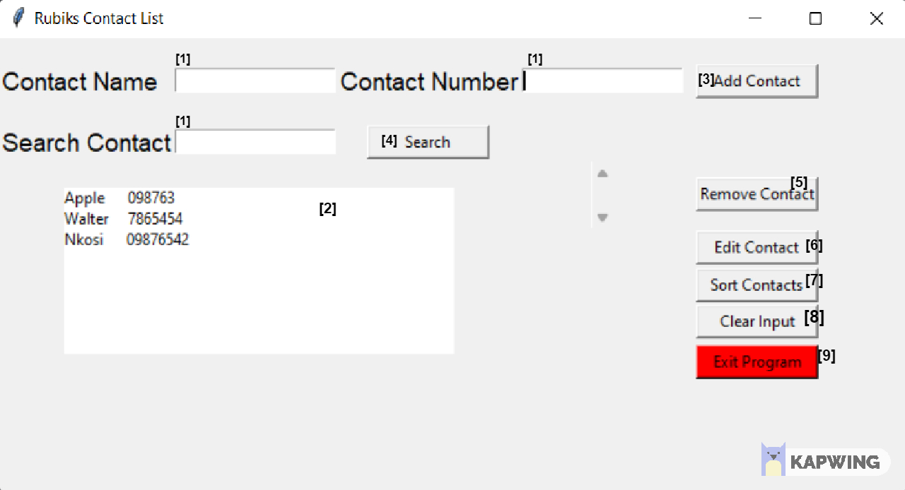

<h1 align="center">Rubiks Contact List</h1>

<p align="center">
  

  

  

  

</p>


<p align="center">
  <a href="#dart-about">About</a> &#xa0; | &#xa0; 
  <a href="#rocket-technologies">Technologies</a> &#xa0; | &#xa0;
  <a href="#white_check_mark-requirements">Requirements</a> &#xa0; | &#xa0;
  <a href="#checkered_flag-using-the-application">Usage</a> &#xa0; | &#xa0;
  <a href="#memo-license">License</a> &#xa0; | &#xa0;
  <a href="https://github.com/nkosi-tauro" target="_blank">Author</a>
</p>

<br>

## :dart: About ##

Welcome to the Rubiks Contact List!  
This is a simple contact list GUI application with basic CRUD functionality built using python and tkinter. 
It allows the user to add, sort, edit, delete and search for contacts. There is no persistent storage, a dictionary is used to temporaliry store the contacts in Key(contact name) and Value(contact number) pairs.


## :rocket: Technologies ##

The following tools were used in this project:

- [Python](https://www.python.org/)
- [tKinter](https://www.tkinter.org/)

## :white_check_mark: Requirements ##

Before starting :checkered_flag:, you need to have [Python 3.8+](https://www.python.org/) and [git](https://git-scm.com/) installed.  

Note : tKinter comes with Python 3.8+ by default. If you are using an older version of Python or if tkinter is not found, you need to install tKinter separately.

```bash
Linux: 
$ sudo apt-get install python3-tk

Mac:
$ python3 -m pip install tkinter

Windows: 
$ pip install tkinter
```


## :checkered_flag: Using the Application ##

Rubiks Contact List is a simple contact list GUI application with basic Create/Add Read/Display Update/Edit Delete/Remove (CRUD) functionality built using python and tkinter.
To start using the application, follow the instructions below to first install and run the application, then you can add, sort, edit, delete and search for contacts.(See related instructions below)

<details>
<summary>📸DEMO Image with Captions</summary>
<br>



1. Input Fields
2. Display List
3. Add Contact button
4. Search button
5. Remove Contact button
6. Edit Contact Button
7. Sort Contact Button
8. Clear Input Button
9. Exit Program Button

</details>
<br>

**Instructions**:

<details>
<summary>Installing and Running the application</summary>
<br>

```bash
# Clone this project
$ git clone https://github.com/nkosi-tauro/contactlist

# Access the project folder
$ cd contactlist

# Run the project in the terminal
Linux/Mac:
$ python3 contactlist.py

Windows:
$ python contactlist.py
```
</details>
<br>

<details>
<summary>Adding New Contacts</summary>
<br>
<b>To Add a new contact</b> :

1. Enter value in the Contact Name and Contact Number fields at the top of the application window
2. Select the <code>Add Contact</code> button located next to the Contact Number field.
3. Accept the prompt to add the new contact by clicking the <code>OK</code> button when prompted or decline to add by clicking <code>Cancel</code>.

</details>
<br>

<details>
<summary>Editing Contacts</summary>
<br>
<b>To Edit a contact</b> : <i>(contact needs to be selected from the displayed list)</i>

1. Select a contact from the displayed list
2. Edit the Contact Number Value using the Contact Number field.
3. Click the <code>Edit Contact</code> button.
4. Accept the prompt to edit the contact by clicking the <code>OK</code> button when prompted or decline to edit by clicking <code>Cancel</code>.


</details>
<br>

<details>
<summary>Deleting Contacts</summary>
<br>
<b>To Delete a contact</b> : <i>(contact needs to be selected from the displayed list)</i>

1. Select a contact from the displayed list
2. Click the <code>Remove Contact</code> button.
3. Accept the prompt to delete the contact by clicking the <code>OK</code> button when prompted or decline to delete by clicking <code>Cancel</code>.


</details>
<br>

<details>
<summary>Searching for Contacts</summary>
<br>
<b>To Search for a contact</b> : 

1. Enter a value in the Search field. (Needs to be the contact name (case sensitive))
2. Click the Search Button.
3. Accept the prompt to search the contact name by clicking the <code>OK</code> button when prompted or decline to search by clicking <code>Cancel</code>.


</details>
<br>

<details>
<summary>Sorting Contacts</summary>
<br>
<b>To Sort the contacts</b> : <i>(contacts will be sorted alphabetically)</i>

1. Click the Sort Contacts button.
2. Accept the prompt to sort the contacts by clicking the <code>OK</code> button when prompted or decline to sort by clicking <code>Cancel</code>.

</details>
<br>

<details>
<summary>Exiting The Application</summary>
<br>
<b>To Exit the application</b> : 

1. Exit the application by clicking the <code>Exit Program</code> button.
2. Accept the prompt to exit the program by clicking the <code>OK</code> button when prompted or decline to exit by clicking <code>Cancel</code>.

</details>
<br>

<details>
<summary>Testing the application</summary>
<br>

```bash
# Run the Unit Tests
Linux/Mac:
$ python3 -m unittest test

Windows:
$ python -m unittest test
```
</details>


## :memo: License ##

This project is under license from Mozilla Public License. For more details, see the [LICENSE](LICENSE.md) file.


Made with :heart: by <a href="https://github.com/nkosi-tauro" target="_blank">Nkosilathi Tauro</a>

&#xa0;

<a href="#top">Back to top</a>
