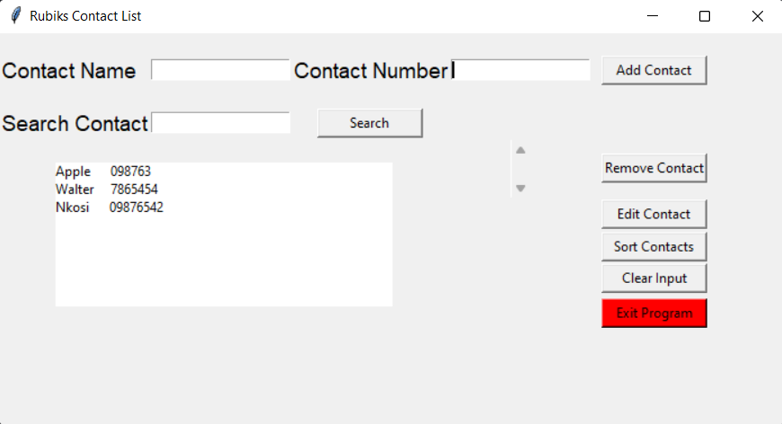

<h1 align="center">Rubiks Contact List</h1>

<p align="center">
  

  

  

  

</p>


<p align="center">
  <a href="#dart-about">About</a> &#xa0; | &#xa0; 
  <a href="#rocket-technologies">Technologies</a> &#xa0; | &#xa0;
  <a href="#white_check_mark-requirements">Requirements</a> &#xa0; | &#xa0;
  <a href="#checkered_flag-starting">Starting</a> &#xa0; | &#xa0;
  <a href="#memo-license">License</a> &#xa0; | &#xa0;
  <a href="https://github.com/nkosi-tauro" target="_blank">Author</a>
</p>

<br>

## :dart: About ##

Welcome to the Rubiks Contact List!  
This is a simple contact list GUI application with basic CRUD functionality built using python and tkinter. 
It allows the user to add, sort, edit, delete and search for contacts. There is no persistent storage yet, a dictionary is used to temporaliry store the contacts in Key(contact name) and Value(contact number) pairs.


## :rocket: Technologies ##

The following tools were used in this project:

- [Python](https://www.python.org/)
- [tKinter](https://www.tkinter.org/)

## :white_check_mark: Requirements ##

Before starting :checkered_flag:, you need to have [Python 3.8+](https://www.python.org/) installed.  
Note : tKinter comes with Python 3.8+ by default. If you are using an older version of Python or if tkinter is not found, you need to install tKinter separately.


## :checkered_flag: Starting ##

```bash
# Clone this project
$ git clone https://github.com/nkosi-tauro/contactlist

#install tkinter if not installed
Linux: 
$ sudo apt-get install python3-tk
Mac:
$ python3 -m pip install tkinter
Windows: 
$ pip install tkinter

# Access the project folder
$ cd contactlist

# Run the project in the terminal or use your favorite IDE

# To run the project in the terminal make sure you have navigated to the project folder. 
# Then run the following command:
$ python contactlist.py

```
## 📸 Demo Image ##



## :memo: License ##

This project is under license from Mozilla Public License. For more details, see the [LICENSE](LICENSE.md) file.


Made with :heart: by <a href="https://github.com/nkosi-tauro" target="_blank">Nkosilathi Tauro</a>

&#xa0;

<a href="#top">Back to top</a>
